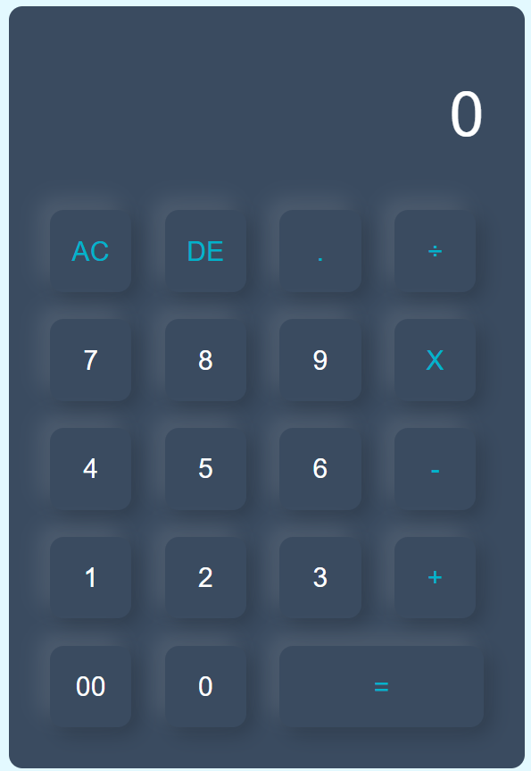

# Calculator-HTML-CSS
Calculator application created with HTML and CSS. It is simple with easy code to help people understand how a calculator works through codes, and how to create one using HTML and CSS

##
The calculator can do the four main calculations. Feel free to contribute if you like

|               HTML Calculator               
:------------------------------------------------:
 
 
